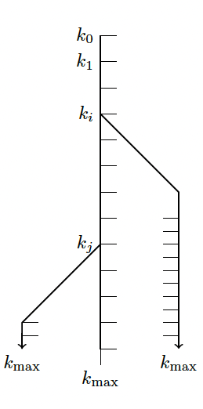

# Linear Mode Connectivity 
itai shapira, May 1st, 2023

Harvard, CS229br Foundations of Deep Learning (aka Topics in the Foundations of Machine Learning)

This repository is dedicated to the in-depth experiment of linear mode connectivity.
Here, you'll find the code, data, and outcomes of our analysis of LMC on widely-used network architectures, such as those for MNIST, CIFAR-10, ImageNet, and Tiny ImageNet.
Please find the full paper in this repository

## Directory Structure

- `checkpoints/`: Contains the saved model checkpoints.
- `data/`: Contains the dataset images.
- `dataframes/`: Contains the computed dataframes, one for each dataset.
- `processed/`: Contains the processed results of the experiments.
- `src/`: Contains the source code for the project.
  - `cifar10.py`: Loads and defines the CIFAR-10 models.
  - `mnist.py`: Loads and defines the MNIST models.
  - `imagenet.py`: Loads and defines the ImageNet models. I didn't use it in the final paper.
  - `tiny_imagenet.py`: Loads and defines the Tiny ImageNet models.
  - `resultsHandler.py`: Handles the results of the experiments.
  - `run_experiment.py`: Runs the experiments.
  - `train.py`: Handles the model training process.  This script contains functions to train and evaluate PyTorch neural network models using early stopping.
  - `lmc_utils.py`: Computes linear mode connectivity and related metrics. This script contains utility functions for working with PyTorch neural networks, including interpolation, parameter extraction, distance calculation, and performance evaluation.

## Results

The results of the experiments can be found in the `processed/` directory in a raw form and `dataframes/` in the aggregated form. The files include:

## Networks and datasets
| Network    | Dataset      | Params | Max Steps | Max Epochs | Batch Size | Train Samples | Final Accuracy | Optimizer |
|------------|--------------|--------|-----------|------------|------------|---------------|----------------|-----------|
| LeNet5     | MNIST        | 62K    | 580       | 10         | 1024       | 60,000        | 0.9818         | Adam      |
| ReducedVGG | CIFAR-10     | 855K   | 11,310    | 29         | 128        | 50,000        | 0.7136         | Adam      |
| AlexNet    | TinyImageNet | 60M    | 14,058    | 9          | 64         | 100,000       | 0.4064         | Adam      |

We investigate image classification networks on MNIST (LeCun [1998]), CIFAR-10 (Krizhevsky et al. [2009]), and TinyImageNet (Deng et al. [2009]), as detailed in Table 1. All hyperparameters are set to standard values from established in previous research:

- For MNIST, we employed the LeNet-5 architecture (LeCun et al. [1998]). The network consists of a total of 7 layers, including 2 convolutional layers, followed by 2 average pooling layers, and 3 fully connected layers.
- For CIFAR-10, we used a reduced version of the VGG-16 architecture (Simonyan and Zisserman [2014]). The modified model consists of four layers in total, with two convolutional layers followed by two fully connected layers. Max-pooling is performed after each convolutional layer, and dropout is applied after each of the fully connected layers. This reduced VGG model has 855,000 parameters, making it less computationally intensive while maintaining the basic structure of the original VGG-16 architecture.
- We used the AlexNet architecture (Krizhevsky et al. [2017]) for TinyImageNet. Comprised of eight layers in total, AlexNet features five convolutional layers followed by three fully connected layers, with the final layer outputting class labels. The first two convolutional layers include batch normalization, while dropout is employed after each of the last two fully connected layers.

Using smaller batch sizes relative to the number of training samples injects more noise into the stochastic weight vector updates performed by SGD, potentially resulting in greater divergence in weight space between the two trained models. The batch sizes and training samples for each dataset are detailed in Table 1. All the architectures examined in this project exhibit overparameterization, in the sense that they have more trainable parameters than data-points.

## Linear Mode Connectivity Experiment
The run_experiment.py file contains an implementation of the linear mode connectivity experiment. The experiment is designed to explore the connectivity between pretrained models and models that continue training from a pretrained model in the context of neural networks.

### Sampling Method
Our efficient training method is designed to search multiple different branch trajectories of stochastic gradient steps, minimizing computational resources. We first train a single model, referred to as the "main branch" trajectory, for the maximum number of epochs, saving checkpoints at each epoch. Subsequently, we reload the model for various k_1 values and continue the training of only one new model for an additional k_2 steps. Afterward, we couple this new model with the original "main branch" model at the k_1 + k_2 position. This approach significantly reduces the computational resources required for the experiment, yet generates samples that depend on the same random initialization. To address this issue, we repeat this process twice.

When we load the checkpoint model, we also load the optimizer from the same point, enabling us to resume its learning schedule. All models are trained using the Cross Entropy loss.

For each pair of `(k_1, k_2)`, we generate two pairs of models which we identify by their weights vectors `w_(k_1+k_2)` and `w_(k_1+k_2)`. These two models are trained using k_2 independent training steps from the same pre-trained model, previously trained for k_1 steps. We then explore the linear path in weight-space between these two models and sample the loss function along this path. We choose 25 equally-spaced points between 0 and 1, denoted by α. For each sampled α, we compute the loss function at the point α `w_(k_1+k_2) + (1-α) w_(k_1+k_2)`.

We examine the interpolation gap, defined as the difference between the interpolation loss and the interpolated loss value:
`L(α w_(k_1+k_2) + (1-α) w_(k_1+k_2)) - α L(w_(k_1+k_2)) + (1-α) L(w_(k_1+k_2))`
The interpolation gap highlights the disparity between the actual loss along the linear path in weight-space and the loss value expected based on the interpolation of the two models. Note that the value is always zero at `α = 0` or `α = 1`. We define the cross entropy train/loss barrier as the maximum sampled interpolation gap. In certain cases, the loss function exhibits convex behavior along the path, resulting in a decrease in loss and a negative interpolation gap. In cases where the context makes it apparent, we regard the barrier as negative in these scenarios.

Additionally, we evaluate not just the loss barrier but also the error barrier, defined as one minus the accuracy. By examining both the train/loss barrier and the error barrier, our empirical analysis offers a thorough understanding of the model's performance and the characteristics of the loss function along the linear path in weight-space.

## Script Files 
### run_experiment
see previous section
### lmc_utilis
The lmc_utilis.py script provides a collection of utility functions to work with PyTorch neural networks. The functions include extracting and setting network parameters, interpolating between two network's parameters, checking if a network is on a given device, computing loss and accuracy of a model on a dataset, calculating L2 distance between two sets of network parameters, and getting model predictions on a given dataset. These utilities are used in the run_experiment.py script to evaluate and compare the performance of the models trained with different configurations.

### train
The train.py script provides a set of functions for training and evaluating PyTorch neural network models using early stopping. The functions include training a model for one epoch, evaluating the model on a validation or test set, and training the model with early stopping. The early stopping mechanism stops the training process if there is no improvement in the validation loss for a specified number of epochs (patience). This script is essential for training and evaluating the models in the run_experiment.py script while preventing overfitting and optimizing training time.

